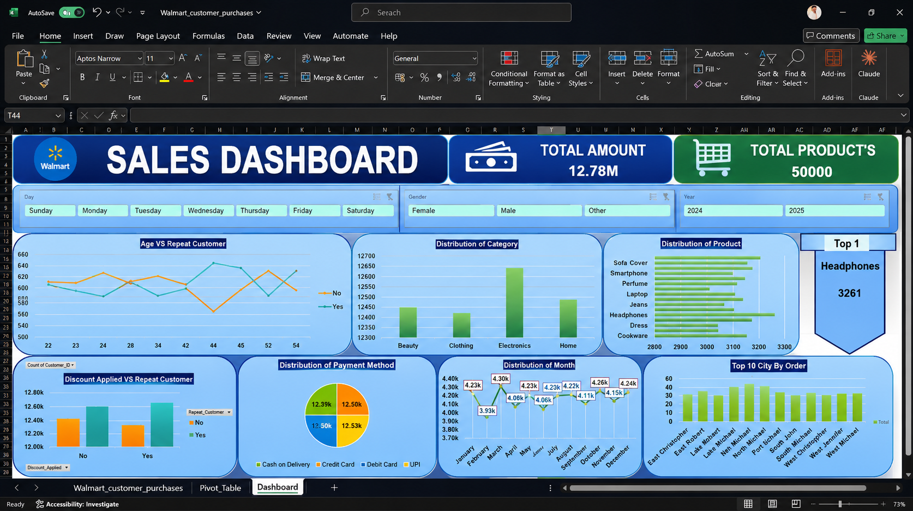

# Walmart Sales Dashboard 📊

## Project Overview

This project is an interactive Sales Dashboard built in Microsoft Excel using Walmart customer purchase data.

The main objective of this dashboard is to transform raw sales data into meaningful business insights through data visualization and interactive reporting.

## Dashboard Preview

> Replace `dashboard.png` with your uploaded dashboard screenshot filename.

---

## Key Metrics

* Total Sales Amount
* Total Products Sold
* Customer Analysis
* Category Performance
* Product Distribution
* Payment Method Analysis
* Monthly Sales Trends
* Top Cities by Orders

---

## Features

✅ Interactive Slicers

✅ Dynamic Filtering

✅ KPI Cards

✅ Pivot Tables

✅ Pivot Charts

✅ Customer Behavior Analysis

✅ Sales Trend Analysis

✅ Business Insights Visualization

---

## Tools Used

* Microsoft Excel
* Pivot Tables
* Pivot Charts
* Slicers
* Data Cleaning
* Data Visualization

---

## Dataset Information

Dataset: Walmart Customer Purchases

The dataset contains customer purchase information including:

* Product Category
* Product Name
* Purchase Amount
* Customer Age
* Payment Method
* City
* Purchase Date
* Discount Status

---

## Business Insights

* Electronics generated the highest sales among categories.
* Monthly sales remained relatively stable throughout the year.
* Headphones emerged as one of the top-selling products.
* Customer purchasing behavior varied across age groups.
* Different payment methods showed almost equal usage distribution.

---

## Learning Outcomes

Through this project, I improved my skills in:

* Excel Dashboard Development
* Data Cleaning
* Data Analysis
* Business Reporting
* Data Visualization
* KPI Tracking

---

## Author

Rahul Sahani

Aspiring Data Analyst | Excel | SQL | Python | Power BI

GitHub: https://github.com/rahulsahani74
LinkedIn: https://www.linkedin.com/in/rahul-sahani-a35813353/?skipRedirect=true

---

⭐ If you found this project useful, feel free to star the repository.
